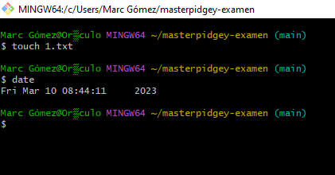
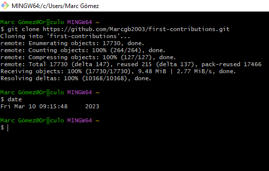
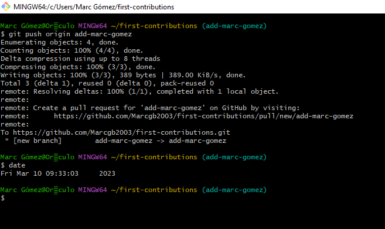

# masterpidgey-examen
# Parte 1
## Paso 1

- Crear el repositorio masterpidgey-examen

- Clonar el repositorio en local
  
## Paso 2
- Crea el documento README.md
  
## Paso 3
- Añadir al README.md los comandos utilizados hasta ahora y hacer un commit inicial con el mensaje commit inicial.
  

## Paso 4

- Subir los cambios al repositorio remoto.
  

## Paso 5

- Crear en el repositorio local un fichero llamado privado.txt.

- Crear en el repositorio local una carpeta llamada privada.

- Realizar los cambios oportunos para que tanto el archivo como
la carpeta sean ignorados por git.

## Paso 6

- Añadir fichero 1.txt al repositorio local.
  

## Paso 7
- Visualizar los commits realizados hasta el momento (el historial).

## Paso 8
- Crear un tag v0.1.

## Paso 9

- Subir los cambios al repositorio remoto.

## Paso 10
- Visualizar de nuevo los commits realizados hasta el momento (el historial).

## Paso 11

- Crear una tabla de este estilo en el fichero README.md
con la información del docente del módulo:

|Nombre|Profesion|Institutos|Github|
|------|---------|----------|------|
|Máximo Fernández|Docente|Francesc de Borja Moll i CESUR|[maximofernandezriera](http://github.com/maximofernandezriera)|

## Paso 12

- Poner a Máximo como colaborador del repositorio masterpidgey-examen

# Parte 2

#### Tal y como vimos en la tarea correspondiente y siguiendo los pasos de este proyecto https://github.com/maximofernandezriera/first-contributions con el apoyo de la guía de DigitalOcean que conocemos https://www.digitalocean.com/community/tutorials/how-to-create-a-pull-request-on-github contribuye con algún cambio.
# Proceso
- Bifurca first contributions

- Clona el repositorio bifurcado

- Crea una rama (Branch)

- Haz los cambios necesarios y confirma (Commit) esos cambios

- Sube tus cambios a GitHub
  

- Envía  tus cambios para ser revisados

