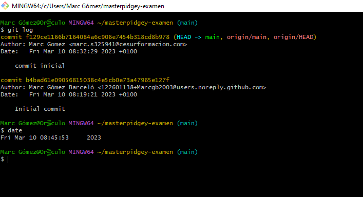
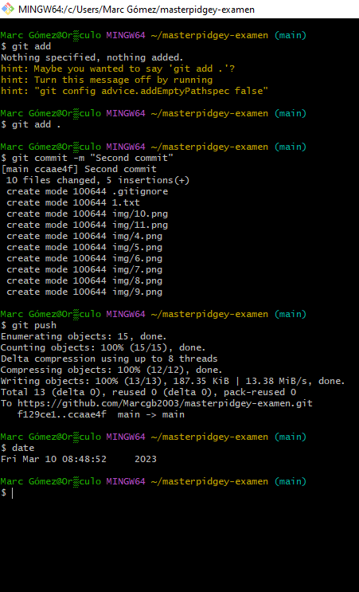

# masterpidgey-examen
# Parte 1
## Paso 1

- Crear el repositorio masterpidgey-examen

    -  Dándole al + de la barra de acceso te permite crear un repositorio.
- Clonar el repositorio en local
  
    - Una vez obtienes el link de tu repositorio puedes clonarlo con el comando git clone.
## Paso 2
- Crea el documento README.md
  
      - El documento puede ser creado tanto automáticamente como manualmente, en mi caso lo he creado automáticamente durante la creación del repositorio
## Paso 3
- Añadir al README.md los comandos utilizados hasta ahora y hacer un commit inicial con el mensaje commit inicial.
  
  -  Tras añadir los comandos y las capturas he hecho **git add .**, ya que me añade todo el contenido de la carpeta; y, tras eso, he hecho el commit.
## Paso 4

- Subir los cambios al repositorio remoto.
  
    - Usando el comando push he subido a mi repositorio todos los ficheros.

## Paso 5

- Crear en el repositorio local un fichero llamado privado.txt.

  - Este documento será ignorado por la máquina después
- Crear en el repositorio local una carpeta llamada privada.

  - Lo mismo pasará con la carpeta privada y sus contenidos 
- Realizar los cambios oportunos para que tanto el archivo como
la carpeta sean ignorados por git.

  - He creado un documento **.gitignore** y le he dado instrucciones de que ignore tanto la carpeta privada como el privado.txt.
## Paso 6

- Añadir fichero 1.txt al repositorio local.
  
    - Usando el comando touch he creado el  fichero 1.txt

## Paso 7
- Visualizar los commits realizados hasta el momento (el historial).

  - Usando git log consulto los cambios y veo que tengo tanto Innitial commit, que es el automático cuando github te crea el README.md, como el commit inicial, que es el que yo he hecho para que me suba los cambios de el susodicho documento.
## Paso 8
- Crear un tag v0.1.

  - Con el comando git tag he creado el tag v0.1
## Paso 9

- Subir los cambios al repositorio remoto.

  - De nuevo con git add . he añadido todos los ficheros, acto seguido he hecho un commit y luego un push.

## Paso 10
- Visualizar de nuevo los commits realizados hasta el momento (el historial).

  - Usando de nuevo el git log puedes ver  que hay un commit nuevo, llamado Second commit. 
## Paso 11

- Crear una tabla de este estilo en el fichero README.md
con la información del docente del módulo:

|Nombre|Profesion|Institutos|Github|
|------|---------|----------|------|
|Máximo Fernández|Docente|Francesc de Borja Moll i CESUR|[maximofernandezriera](http://github.com/maximofernandezriera)|

  - A la izquierda puedes ver como es en el propio código de Markdown y a la derecha como se verá en la página de portada del repositorio.
## Paso 12

- Poner a Máximo como colaborador del repositorio masterpidgey-examen

  -  Para añadir a un colaborador no tienes más que entrar a Settings, después abrir la pestaña de Collaborators y pulsar el botón verde que pone Add people.
# Parte 2

#### Tal y como vimos en la tarea correspondiente y siguiendo los pasos de este proyecto https://github.com/maximofernandezriera/first-contributions con el apoyo de la guía de DigitalOcean que conocemos https://www.digitalocean.com/community/tutorials/how-to-create-a-pull-request-on-github contribuye con algún cambio.
# Proceso
- Bifurca first contributions

  - Para bifurcar el repositorio debes darle al botón de fork que hay arriba a la izquierda. La imagen que yo he colgado muestra como está el documento una vez he hecho el fork 

- Clona el repositorio bifurcado

  - De nuevo con git clone he clonado en mi sistema el repositorio,
- Crea una rama (Branch)

  - Primero he abierto la carpeta y luego he creado una rama llamada add-marc-gomez.
- Haz los cambios necesarios y confirma (Commit) esos cambios

  - He añadido un pequeño código de Python llamado Marcs_code que te indica si el día actual el par o impar.

  - En este caso he añadido específicamente Marcs_code.py, para no repetir lo mismo que puse anteriormente dos veces, e hice el commit llamándolo "Contribución de Marc Gómez Barceló".

- Sube tus cambios a GitHub
  
    - Con el comando git push los subo a Github.

- Envía  tus cambios para ser revisados

  - He añadido una pequeña descripción de lo que he hecho y he realizado el pull request.